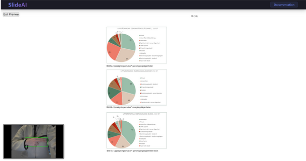
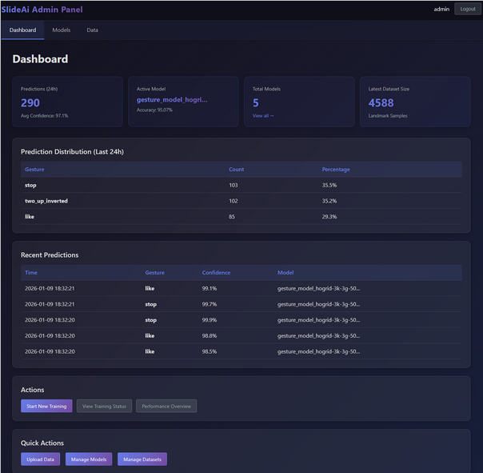
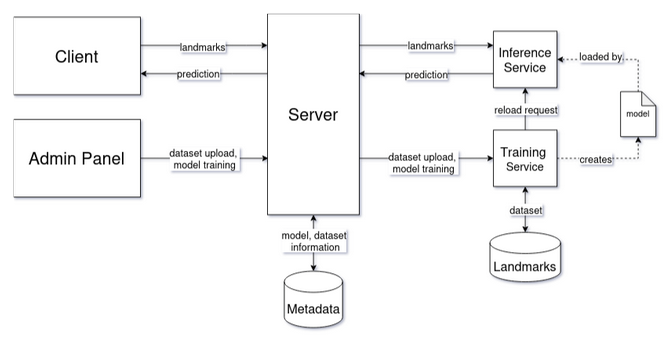
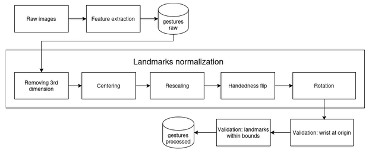
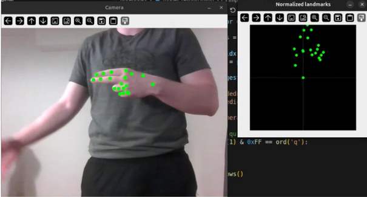

# SlideAI

## Description

AI-powered web application that uses a standard webcam to interpret hand gestures in real time. A cloud-deployed machine learning pipeline processes the video stream directly in the user’s browser, detects hand positions, and classifies gestures. These recognized gestures are then mapped to slide navigation actions or other on-screen controls. The result is a fully contactless, accessible, and user-friendly way to interact with slideshows, no hardware required.


---

## Table of Contents

* [System Overview](#system-overview)
* [Prerequisites](#prerequisites)
* [Running the application with a pretrained model](#running-the-application-with-a-pretrained-model)
* [Dataset for model training](#dataset-for-model-training)
* [License](#license)

---

## System Overview

### Frontend view (triggering "next_slide")



### Admin Panel view



### High Level System architecture



### Data preprocessing pipeline




### End model performance


## Prerequisites

### Required

To run the application locally, depending on your OS you are required to have:

* **Windows:** Docker Desktop with WSL2 backend
* **macOS:** Docker Desktop
* **Linux:** Docker Engine + Docker Compose

### Optional (For GPU Training)

* **NVIDIA GPU** with CUDA support
* **NVIDIA Drivers** installed on host (Docker handles CUDA/cuDNN internally).

> **Note**: You do NOT need to install the NVIDIA CUDA Toolkit on the host.
> **Note**: No Python installation required on host machine. Everything runs in Docker.

---
## Running the application with a pretrained model

### 1. Clone the Repository

```bash
git clone <repository-url>
cd team4
```

### 2. Start Application


```bash
docker compose up
```


### 3. Set up Admin Panel
Open a separate terminal and run the following steps:

####  3.1. Run migrations

```bash
docker-compose exec web python manage.py makemigrations core
```

```bash
docker-compose exec web python manage.py migrate
```

#### 3.2 Create admin user

```bash
docker-compose exec web python initialize_admin.py
```


### 4. Access the Application

* User Interface: [http://localhost:5173](http://localhost:5173)
* Admin Panel: [http://localhost:8001/admin/](http://localhost:8001/admin/)

> Note: The default credentials for admin panel are: 
> 
> Login: admin
> 
> Password: admin123

---

## Dataset for model training
The source dataset we used for training can be found here: [HaGRID Classification 512p](https://www.kaggle.com/datasets/innominate817/hagrid-classification-512p) by Innominate817 licensed under a [CC BY-SA 4.0](https://creativecommons.org/licenses/by-sa/4.0/).

We recommend using [this](https://chalmers-my.sharepoint.com/:f:/g/personal/maksymm_chalmers_se/IgA0dUolF7dFQ5A2M11-G8a3Adir32hl0w7KakaoqvU3cYc?e=PbbTAV) dataset for local training, as we have already trimmed it to only include the gestures supported by the application.
If you are having troubles accessing the link, try using incognito mode.


---

## License

This project is developed for academic purposes as part of DIT826 coursework at Chalmers University of Technology / University of Gothenburg.
